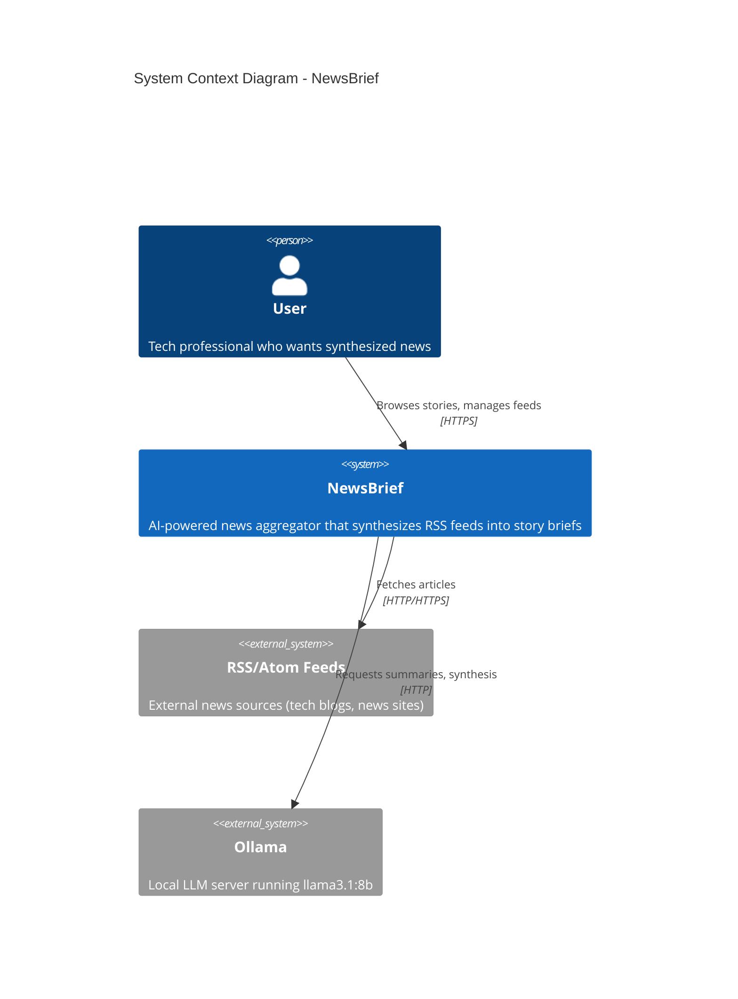
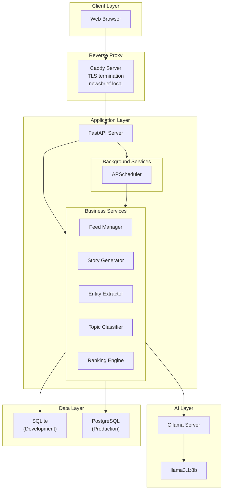
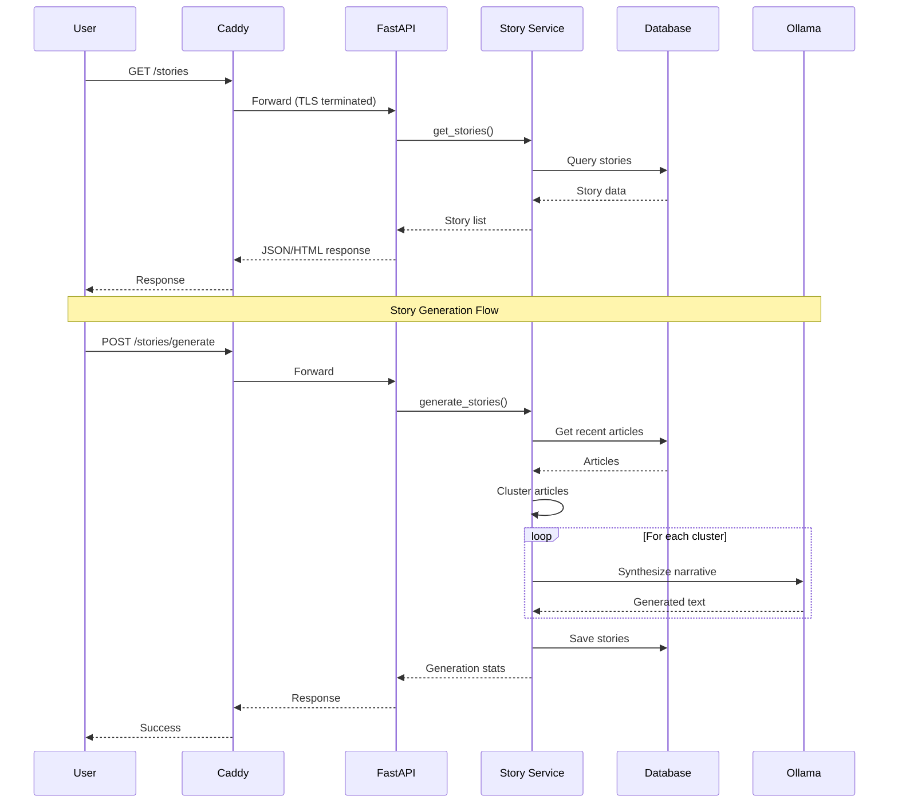
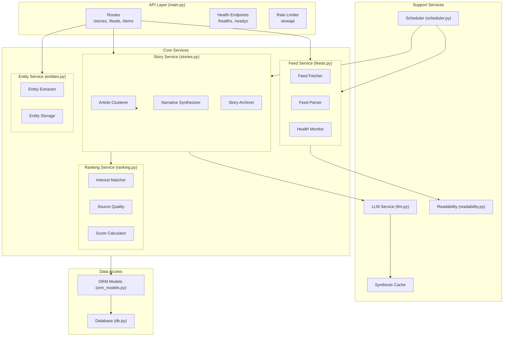
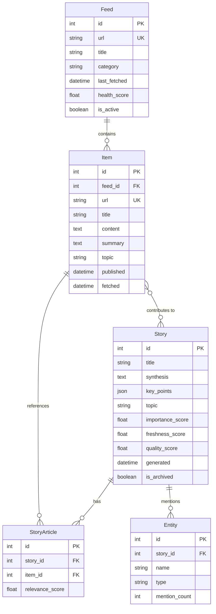
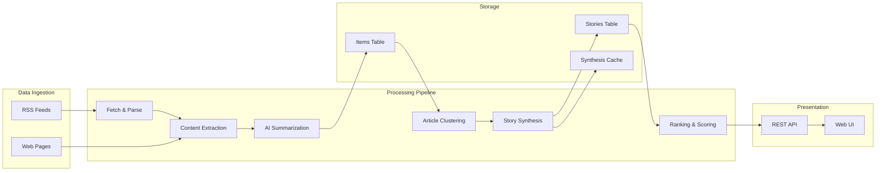
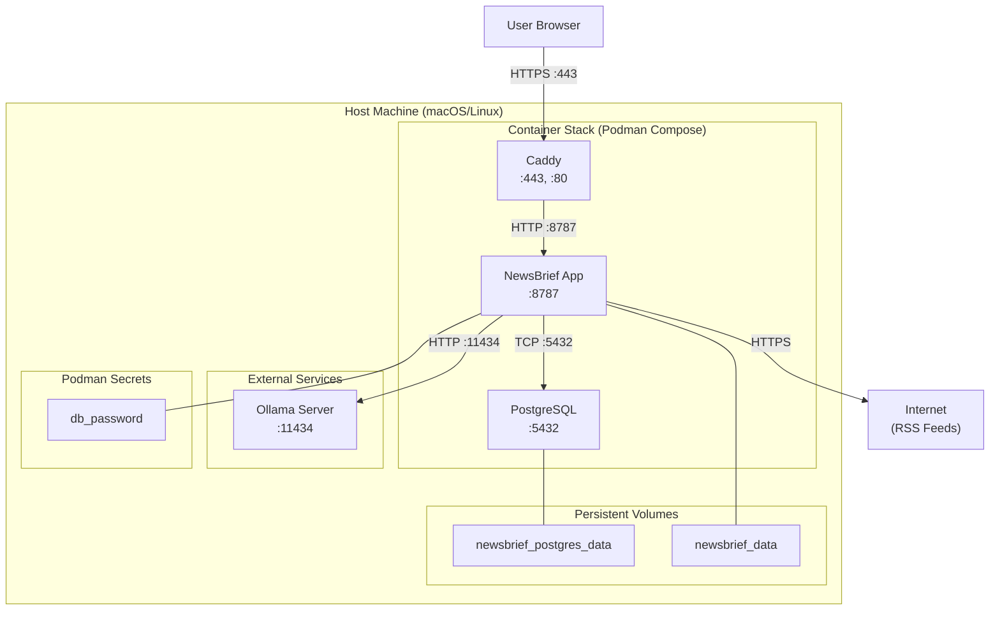
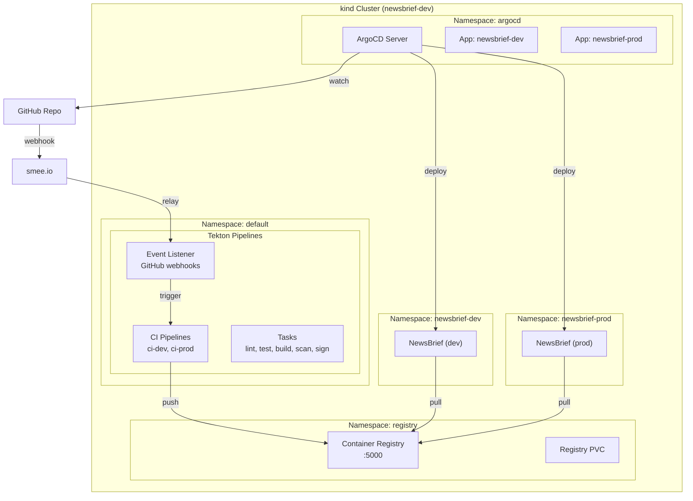
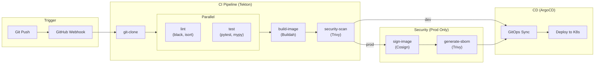
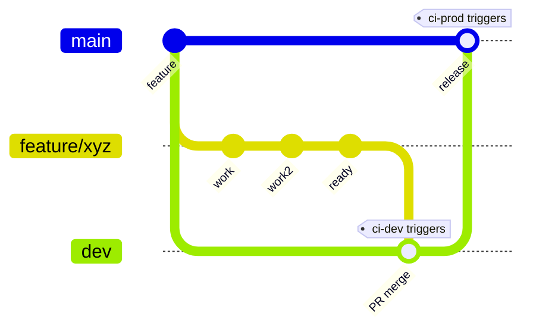

# NewsBrief Architecture Document

> **Version**: 1.0
> **Last Updated**: January 2026
> **Status**: Living Document

---

## Table of Contents

1. [Introduction](#1-introduction)
2. [Requirements](#2-requirements)
3. [Non-Functional Requirements](#3-non-functional-requirements)
4. [Architectural Principles](#4-architectural-principles)
5. [System Context](#5-system-context)
6. [Architecture Overview](#6-architecture-overview)
7. [Component Architecture](#7-component-architecture)
8. [Data Architecture](#8-data-architecture)
9. [Deployment Architecture](#9-deployment-architecture)
10. [CI/CD Architecture](#10-cicd-architecture)
11. [Decision Log](#11-decision-log)

---

## 1. Introduction

### 1.1 Purpose

This document describes the architecture of NewsBrief, an AI-powered news aggregator that synthesizes multiple RSS sources into daily story briefs. It serves as the authoritative reference for technical decisions, system boundaries, and design rationale.

### 1.2 Scope

NewsBrief is a **self-hosted, privacy-focused** application designed to:
- Replace reading 50+ article summaries with 5-10 synthesized stories
- Reduce daily news consumption time from 30+ minutes to 2 minutes
- Run entirely locally with no external dependencies (except RSS feeds)

### 1.3 Audience

- **Developers**: Understanding system design for contributions
- **Operators**: Deployment and operational guidance
- **Future Self**: Context for past decisions

### 1.4 Document Conventions

- Diagrams use [Mermaid](https://mermaid.js.org/) syntax
- Requirements use MoSCoW prioritization (Must/Should/Could/Won't)
- ADR references link to detailed Architecture Decision Records

---

## 2. Requirements

### 2.1 Functional Requirements

| ID | Requirement | Priority | Status |
|----|-------------|----------|--------|
| **FR-01** | Fetch articles from RSS/Atom feeds | Must | ✅ Complete |
| **FR-02** | Extract clean article content from web pages | Must | ✅ Complete |
| **FR-03** | Generate AI summaries of individual articles | Must | ✅ Complete |
| **FR-04** | Cluster related articles into stories | Must | ✅ Complete |
| **FR-05** | Synthesize multi-article narratives using LLM | Must | ✅ Complete |
| **FR-06** | Extract entities (companies, people, products) | Must | ✅ Complete |
| **FR-07** | Classify stories by topic (Security, AI/ML, etc.) | Must | ✅ Complete |
| **FR-08** | Schedule automatic feed refresh and story generation | Must | ✅ Complete |
| **FR-09** | Provide web interface for browsing stories | Must | ✅ Complete |
| **FR-10** | Support OPML import/export for feed management | Should | ✅ Complete |
| **FR-11** | Rank stories by user interests | Should | ✅ Complete |
| **FR-12** | Weight sources by quality/reliability | Should | ✅ Complete |
| **FR-13** | Archive old stories automatically | Should | ✅ Complete |
| **FR-14** | Full-text search across articles | Could | 🔜 Planned |
| **FR-15** | Semantic search using embeddings | Could | 🔜 Planned |
| **FR-16** | User accounts and authentication | Won't (v1.0) | 📋 Future |

### 2.2 User Stories

**Primary User Story**:
> As a busy professional, I want to see a synthesized summary of today's tech news so that I can stay informed in 2 minutes instead of 30.

**Supporting User Stories**:
- As a user, I want to add my favorite RSS feeds so that I get news from sources I trust
- As a user, I want stories grouped by topic so that I can focus on areas I care about
- As a user, I want to see which articles contributed to a story so that I can read the originals if interested
- As a user, I want the system to run locally so that my reading habits remain private

---

## 3. Non-Functional Requirements

### 3.1 Performance

| ID | Requirement | Target | Status |
|----|-------------|--------|--------|
| **NFR-P01** | Story generation for 100 articles | < 5 minutes | ✅ Met |
| **NFR-P02** | Page load time (story list) | < 2 seconds | ✅ Met |
| **NFR-P03** | API response time (cached) | < 100ms | ✅ Met |
| **NFR-P04** | Feed refresh (50 feeds) | < 3 minutes | ✅ Met |

### 3.2 Reliability

| ID | Requirement | Target | Status |
|----|-------------|--------|--------|
| **NFR-R01** | Application availability | 99% (local) | ✅ Met |
| **NFR-R02** | Data durability | No data loss on restart | ✅ Met |
| **NFR-R03** | Graceful LLM failure handling | Fallback summaries | ✅ Met |
| **NFR-R04** | Feed failure isolation | One feed failure doesn't block others | ✅ Met |

### 3.3 Security

| ID | Requirement | Target | Status |
|----|-------------|--------|--------|
| **NFR-S01** | HTTPS/TLS encryption | All traffic encrypted | ✅ Complete |
| **NFR-S02** | Secrets management | Encrypted at rest | ✅ Complete |
| **NFR-S03** | API rate limiting | Prevent abuse | ✅ Complete |
| **NFR-S04** | Container vulnerability scanning | No CRITICAL CVEs | ✅ Complete |
| **NFR-S05** | Image signing | Signed production images | ✅ Complete |
| **NFR-S06** | SBOM generation | Software bill of materials | ✅ Complete |

### 3.4 Scalability

| ID | Requirement | Target | Status |
|----|-------------|--------|--------|
| **NFR-SC01** | Concurrent users | 1-5 (personal use) | ✅ Met |
| **NFR-SC02** | Feed count | Up to 100 feeds | ✅ Met |
| **NFR-SC03** | Article volume | 1000+ articles/day | ✅ Met |
| **NFR-SC04** | Story retention | 30 days default | ✅ Met |

### 3.5 Maintainability

| ID | Requirement | Target | Status |
|----|-------------|--------|--------|
| **NFR-M01** | Test coverage | > 40% | ✅ Met (41%) |
| **NFR-M02** | Type safety | mypy clean | ✅ Met |
| **NFR-M03** | Documentation | ADRs for major decisions | ✅ Met |
| **NFR-M04** | CI/CD automation | Automated testing & deployment | ✅ Met |

### 3.6 Privacy

| ID | Requirement | Target | Status |
|----|-------------|--------|--------|
| **NFR-PR01** | No telemetry | Zero external analytics | ✅ Met |
| **NFR-PR02** | Local LLM processing | No API calls to cloud LLMs | ✅ Met |
| **NFR-PR03** | Data locality | All data stored locally | ✅ Met |
| **NFR-PR04** | Offline capability | Works without internet (after feed fetch) | ✅ Met |

---

## 4. Architectural Principles

These principles guide all architectural decisions for NewsBrief:

### P1: Privacy First
> **All data processing happens locally. No telemetry, no cloud dependencies for core functionality.**

- LLM runs locally via Ollama
- No external API calls except RSS feed fetching
- Reading habits never leave the user's machine

### P2: Local First
> **The application must function offline after initial feed fetch.**

- All data stored locally (SQLite/PostgreSQL)
- No required internet connectivity for browsing
- Graceful degradation when services unavailable

### P3: Simplicity Over Cleverness
> **Prefer simple, understandable solutions over complex optimizations.**

- Monolithic architecture until complexity demands otherwise
- Standard libraries over exotic dependencies
- Clear code over clever code

### P4: User Control
> **Users own their data and can easily export, backup, and migrate.**

- OPML import/export for feeds
- Database backup/restore commands
- No vendor lock-in

### P5: Secure by Default
> **Security is not optional; it's built into every layer.**

- HTTPS by default (even locally)
- Secrets encrypted at rest
- Container scanning in CI/CD
- Signed container images

### P6: Observable Operations
> **The system should be easy to monitor, debug, and understand.**

- Structured logging (JSON in production)
- Health endpoints for all critical services
- Clear error messages and failure modes

---

## 5. System Context

### 5.1 System Context Diagram

### 5.2 External Dependencies

| System | Purpose | Required | Local |
|--------|---------|----------|-------|
| **RSS/Atom Feeds** | News sources | Yes | No (external) |
| **Ollama** | LLM inference | No (graceful fallback) | Yes |
| **PostgreSQL** | Production database | No (SQLite fallback) | Yes |
| **Caddy** | Reverse proxy, TLS | No (direct access fallback) | Yes |

### 5.3 Actors

| Actor | Description | Interaction |
|-------|-------------|-------------|
| **User** | Primary consumer of synthesized news | Web browser, API |
| **Scheduler** | Internal automated job runner | Triggers feed refresh, story generation |
| **CI/CD System** | Tekton pipelines | Builds, tests, deploys |

---

## 6. Architecture Overview

### 6.1 High-Level Architecture

### 6.2 Request Flow

### 6.3 Technology Stack

| Layer | Technology | Rationale |
|-------|------------|-----------|
| **Web Framework** | FastAPI | Async, auto OpenAPI, Pydantic validation |
| **Templates** | Jinja2 | Server-rendered, no build step |
| **Styling** | Tailwind CSS | Utility-first, locally built |
| **Database (Dev)** | SQLite | Zero-config, single-file |
| **Database (Prod)** | PostgreSQL 16 | ACID, concurrent writes |
| **ORM** | SQLAlchemy 2.0 | Database abstraction |
| **Migrations** | Alembic | Schema versioning |
| **LLM** | Ollama (llama3.1:8b) | Local, private, free |
| **Scheduler** | APScheduler | Python-native background jobs |
| **Content Extraction** | Mozilla Readability | Clean article extraction |
| **Reverse Proxy** | Caddy | Auto TLS, simple config |
| **Container Runtime** | Podman/Docker | OCI-compliant |
| **Orchestration** | Podman Compose | Multi-container |

---

## 7. Component Architecture

### 7.1 Component Diagram

### 7.2 Key Components

| Component | Responsibility | Key Files |
|-----------|----------------|-----------|
| **Feed Manager** | RSS fetching, parsing, health monitoring | `feeds.py` |
| **Story Generator** | Clustering, synthesis, archiving | `stories.py` |
| **Entity Extractor** | NER for companies, people, products | `entities.py` |
| **Topic Classifier** | Categorization (Security, AI/ML, etc.) | `topics.py` |
| **Ranking Engine** | Interest matching, source weighting | `ranking.py` |
| **LLM Service** | Ollama integration, prompt management | `llm.py` |
| **Readability** | Article content extraction | `readability.py` |
| **Scheduler** | Background job orchestration | `scheduler.py` |
| **Synthesis Cache** | LLM response caching | `synthesis_cache.py` |

---

## 8. Data Architecture

### 8.1 Entity Relationship Diagram

### 8.2 Data Flow

---

## 9. Deployment Architecture

### 9.1 Production Deployment

### 9.2 Development vs Production

| Aspect | Development | Production |
|--------|-------------|------------|
| **URL** | `http://localhost:8787` | `https://newsbrief.local` |
| **Database** | SQLite | PostgreSQL |
| **TLS** | None | Caddy auto-certs |
| **Secrets** | `.env` file | Podman Secrets |
| **Logging** | Human-readable | JSON structured |
| **Visual** | DEV banner | Clean UI |
| **Command** | `make dev` | `make deploy` |

### 9.3 Kubernetes Deployment (Local)

---

## 10. CI/CD Architecture

### 10.1 Pipeline Overview

### 10.2 Security Gates

| Gate | Tool | Dev | Prod | Action on Failure |
|------|------|-----|------|-------------------|
| **Vulnerability Scan** | Trivy | ✅ | ✅ | Block on CRITICAL |
| **Image Signing** | Cosign | ❌ | ✅ | Required for deploy |
| **SBOM Generation** | Trivy | ❌ | ✅ | Audit trail |
| **Code Quality** | black, isort | ✅ | ✅ | Block pipeline |
| **Type Checking** | mypy | ✅ | ✅ | Block pipeline |
| **Unit Tests** | pytest | ✅ | ✅ | Block pipeline |

### 10.3 Environment Promotion

| Branch | Pipeline | Image Tag | Deploy To |
|--------|----------|-----------|-----------|
| `dev` | ci-dev | `dev-latest` | newsbrief-dev |
| `main` | ci-prod | `v0.7.5` | newsbrief-prod |

---

## 11. Decision Log

All significant architectural decisions are documented as ADRs (Architecture Decision Records):

| ADR | Title | Status |
|-----|-------|--------|
| [ADR-0001](adr/0001-architecture.md) | Initial Architecture | Accepted |
| [ADR-0002](adr/0002-story-based-aggregation.md) | Story-Based Aggregation | Accepted |
| [ADR-0003](adr/0003-synthesis-caching.md) | Synthesis Caching | Accepted |
| [ADR-0004](adr/0004-incremental-story-updates.md) | Incremental Story Updates | Accepted |
| [ADR-0005](adr/0005-interest-based-ranking.md) | Interest-Based Ranking | Accepted |
| [ADR-0006](adr/0006-source-quality-weighting.md) | Source Quality Weighting | Accepted |
| [ADR-0007](adr/0007-postgresql-database-migration.md) | PostgreSQL Migration | Accepted |
| [ADR-0008](adr/0008-apple-containers-deferred.md) | Apple Containers Deferred | Deferred |
| [ADR-0009](adr/0009-secrets-management-strategy.md) | Secrets Management | Accepted |
| [ADR-0010](adr/0010-caddy-reverse-proxy.md) | Caddy Reverse Proxy | Accepted |
| [ADR-0011](adr/0011-structured-logging.md) | Structured Logging | Accepted |
| [ADR-0012](adr/0012-https-tls-encryption.md) | HTTPS/TLS Encryption | Accepted |
| [ADR-0013](adr/0013-podman-secrets.md) | Podman Secrets | Accepted |
| [ADR-0014](adr/0014-api-rate-limiting.md) | API Rate Limiting | Accepted |
| [ADR-0015](adr/0015-local-kubernetes-distribution.md) | Local Kubernetes (kind) | Accepted |
| [ADR-0016](adr/0016-cicd-platform-migration.md) | CI/CD Platform (Tekton) | Accepted |
| [ADR-0017](adr/0017-gitops-tooling.md) | GitOps Tooling (ArgoCD) | Accepted |
| [ADR-0018](adr/0018-secure-supply-chain.md) | Secure Supply Chain | Accepted |
| [ADR-0019](adr/0019-cicd-pipeline-design.md) | CI/CD Pipeline Design | Accepted |

---

## Appendix A: Glossary

| Term | Definition |
|------|------------|
| **Story** | A synthesized narrative combining multiple related articles |
| **Item** | An individual article fetched from an RSS feed |
| **Entity** | A named thing (company, person, product) extracted from text |
| **Synthesis** | The LLM-generated narrative for a story |
| **Cluster** | A group of related articles identified by similarity |
| **Feed Health** | A score indicating feed reliability and freshness |

## Appendix B: References

- [Project README](../README.md)
- [Development Guide](development/DEVELOPMENT.md)
- [Kubernetes Setup](development/KUBERNETES.md)
- [CI/CD Guide](development/CI-CD.md)
- [API Documentation](user-guide/API.md)
- [Architectural Roadmap](adr/ARCHITECTURAL_ROADMAP.md)

---

*This document should be updated with each major architectural change.*
