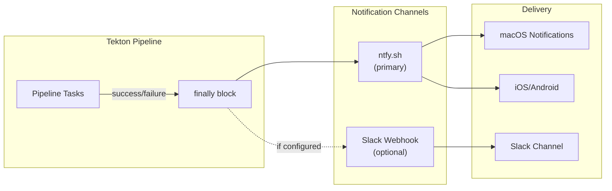

# NewsBrief Architecture Document

> **Version**: 1.1
> **Last Updated**: February 2026
> **Status**: Living Document

---

> **Future Direction**: NewsBrief is evolving from a news aggregator into an intelligence platform. See [ADR-0023: Intelligence Platform Strategy](adr/0023-intelligence-platform-strategy.md) for the strategic vision covering entity intelligence, multi-perspective synthesis, and premium features.

---

## Table of Contents

1. [Introduction](#1-introduction)
2. [Requirements](#2-requirements)
3. [Non-Functional Requirements](#3-non-functional-requirements)
4. [Architectural Principles](#4-architectural-principles)
5. [System Context](#5-system-context)
6. [Architecture Overview](#6-architecture-overview)
7. [Component Architecture](#7-component-architecture)
8. [Data Architecture](#8-data-architecture)
9. [Deployment Architecture](#9-deployment-architecture)
10. [CI/CD Architecture](#10-cicd-architecture)
11. [Decision Log](#11-decision-log)

---

## 1. Introduction

### 1.1 Purpose

This document describes the architecture of NewsBrief, an AI-powered news aggregator that synthesizes multiple RSS sources into daily story briefs. It serves as the authoritative reference for technical decisions, system boundaries, and design rationale.

### 1.2 Scope

NewsBrief is a **self-hosted, privacy-focused** application designed to:
- Replace reading 50+ article summaries with 5-10 synthesized stories
- Reduce daily news consumption time from 30+ minutes to 2 minutes
- Run entirely locally with no external dependencies (except RSS feeds)

### 1.3 Audience

- **Developers**: Understanding system design for contributions
- **Operators**: Deployment and operational guidance
- **Future Self**: Context for past decisions

### 1.4 Document Conventions

- Diagrams use [Mermaid](https://mermaid.js.org/) syntax
- Requirements use MoSCoW prioritization (Must/Should/Could/Won't)
- ADR references link to detailed Architecture Decision Records

---

## 2. Requirements

### 2.1 Functional Requirements

| ID | Requirement | Priority | Status |
|----|-------------|----------|--------|
| **FR-01** | Fetch articles from RSS/Atom feeds | Must | ✅ Complete |
| **FR-02** | Extract clean article content from web pages | Must | ✅ Complete |
| **FR-03** | Generate AI summaries of individual articles | Must | ✅ Complete |
| **FR-04** | Cluster related articles into stories | Must | ✅ Complete |
| **FR-05** | Synthesize multi-article narratives using LLM | Must | ✅ Complete |
| **FR-06** | Extract entities (companies, people, products) | Must | ✅ Complete |
| **FR-07** | Classify stories by topic (Security, AI/ML, etc.) | Must | ✅ Complete |
| **FR-08** | Schedule automatic feed refresh and story generation | Must | ✅ Complete |
| **FR-09** | Provide web interface for browsing stories | Must | ✅ Complete |
| **FR-10** | Support OPML import/export for feed management | Should | ✅ Complete |
| **FR-11** | Rank stories by user interests | Should | ✅ Complete |
| **FR-12** | Weight sources by quality/reliability | Should | ✅ Complete |
| **FR-13** | Archive old stories automatically | Should | ✅ Complete |
| **FR-14** | Full-text search across articles | Could | 🔜 Planned |
| **FR-15** | Semantic search using embeddings | Could | 🔜 Planned |
| **FR-16** | User accounts and authentication | Won't (v1.0) | 📋 Future |

### 2.2 User Stories

**Primary User Story**:
> As a busy professional, I want to see a synthesized summary of today's tech news so that I can stay informed in 2 minutes instead of 30.

**Supporting User Stories**:
- As a user, I want to add my favorite RSS feeds so that I get news from sources I trust
- As a user, I want stories grouped by topic so that I can focus on areas I care about
- As a user, I want to see which articles contributed to a story so that I can read the originals if interested
- As a user, I want the system to run locally so that my reading habits remain private

---

## 3. Non-Functional Requirements

### 3.1 Performance

| ID | Requirement | Target | Status |
|----|-------------|--------|--------|
| **NFR-P01** | Story generation for 100 articles | < 5 minutes | ✅ Met |
| **NFR-P02** | Page load time (story list) | < 2 seconds | ✅ Met |
| **NFR-P03** | API response time (cached) | < 100ms | ✅ Met |
| **NFR-P04** | Feed refresh (50 feeds) | < 3 minutes | ✅ Met |

### 3.2 Reliability

| ID | Requirement | Target | Status |
|----|-------------|--------|--------|
| **NFR-R01** | Application availability | 99% (local) | ✅ Met |
| **NFR-R02** | Data durability | No data loss on restart | ✅ Met |
| **NFR-R03** | Graceful LLM failure handling | Fallback summaries | ✅ Met |
| **NFR-R04** | Feed failure isolation | One feed failure doesn't block others | ✅ Met |

### 3.3 Security

| ID | Requirement | Target | Status |
|----|-------------|--------|--------|
| **NFR-S01** | HTTPS/TLS encryption | All traffic encrypted | ✅ Complete |
| **NFR-S02** | Secrets management | Encrypted at rest | ✅ Complete |
| **NFR-S03** | API rate limiting | Prevent abuse | ✅ Complete |
| **NFR-S04** | Container vulnerability scanning | No CRITICAL CVEs | ✅ Complete |
| **NFR-S05** | Image signing | Signed production images | ✅ Complete |
| **NFR-S06** | SBOM generation | Software bill of materials | ✅ Complete |

### 3.4 Scalability

| ID | Requirement | Target | Status |
|----|-------------|--------|--------|
| **NFR-SC01** | Concurrent users | 1-5 (personal use) | ✅ Met |
| **NFR-SC02** | Feed count | Up to 100 feeds | ✅ Met |
| **NFR-SC03** | Article volume | 1000+ articles/day | ✅ Met |
| **NFR-SC04** | Story retention | 30 days default | ✅ Met |

### 3.5 Maintainability

| ID | Requirement | Target | Status |
|----|-------------|--------|--------|
| **NFR-M01** | Test coverage | > 40% | ✅ Met (41%) |
| **NFR-M02** | Type safety | mypy clean | ✅ Met |
| **NFR-M03** | Documentation | ADRs for major decisions | ✅ Met |
| **NFR-M04** | CI/CD automation | Automated testing & deployment | ✅ Met |

### 3.6 Privacy

| ID | Requirement | Target | Status |
|----|-------------|--------|--------|
| **NFR-PR01** | No telemetry | Zero external analytics | ✅ Met |
| **NFR-PR02** | Local LLM processing | No API calls to cloud LLMs | ✅ Met |
| **NFR-PR03** | Data locality | All data stored locally | ✅ Met |
| **NFR-PR04** | Offline capability | Works without internet (after feed fetch) | ✅ Met |

---

## 4. Architectural Principles

These principles guide all architectural decisions for NewsBrief. Each principle includes the statement, rationale (the "why"), and implications (behaviors and constraints).

---

### P1: Privacy First

> **All data processing happens locally. No telemetry, no cloud dependencies for core functionality.**

**Rationale**

News consumption patterns reveal intimate details about a person's interests, concerns, and worldview. Users should not have to sacrifice their privacy to stay informed. By processing everything locally, we eliminate the risk of data breaches, surveillance, and behavioral profiling by third parties.

**Implications**

| Behavior | Constraint |
|----------|------------|
| LLM runs locally via Ollama | Cannot use cloud-hosted LLM APIs (OpenAI, Anthropic, etc.) |
| No analytics or telemetry | Cannot collect usage metrics for product improvement |
| Reading habits stay on-device | Cannot offer cross-device sync without user-controlled infrastructure |
| External calls limited to RSS fetching | Must implement all features with local-only processing |

---

### P2: Local First

> **The application must function fully offline after initial feed fetch.**

**Rationale**

Network availability should not gate access to already-fetched information. Users may be traveling, on metered connections, or simply prefer reduced connectivity. A local-first approach ensures the application remains useful regardless of network conditions and reduces latency for all operations.

**Implications**

| Behavior | Constraint |
|----------|------------|
| All data stored locally (SQLite/PostgreSQL) | Must manage database lifecycle, backups, and migrations locally |
| Full functionality without internet | Cannot rely on remote services for core features |
| Graceful degradation when services unavailable | Must handle Ollama/network failures without crashing |
| Optimistic UI updates | Must design for eventual consistency with feed sources |

---

### P3: Simplicity Over Cleverness

> **Prefer simple, understandable solutions over complex optimizations.**

**Rationale**

NewsBrief is a personal project that may be maintained sporadically. Complex architectures increase cognitive load on return, extend debugging time, and create barriers to contribution. Simplicity reduces the total cost of ownership and makes the codebase accessible to future maintainers (including future self).

**Implications**

| Behavior | Constraint |
|----------|------------|
| Monolithic architecture | Do not introduce microservices until complexity demands it |
| Standard libraries preferred | Avoid exotic dependencies that increase learning curve |
| Clear code over clever code | Reject optimizations that sacrifice readability |
| Single deployment unit | Accept some inefficiency in exchange for operational simplicity |
| Minimal abstraction layers | Create abstractions only when used in 3+ places |

---

### P4: User Control

> **Users own their data and can easily export, backup, and migrate.**

**Rationale**

Users invest time curating feeds and building reading history. This investment should not be held hostage by application decisions. Providing data portability respects user autonomy, builds trust, and ensures users can migrate away if the project is abandoned or better alternatives emerge.

**Implications**

| Behavior | Constraint |
|----------|------------|
| OPML import/export for feeds | Must maintain compatibility with standard feed formats |
| Database backup/restore commands | Must provide simple CLI tools for data management |
| No vendor lock-in | Avoid proprietary formats or cloud-only features |
| Human-readable storage where practical | Prefer JSON/YAML configs over binary formats |
| Documented data schema | Must keep schema documentation current |

---

### P5: Secure by Default

> **Security is not optional; it's built into every layer.**

**Rationale**

Even self-hosted applications face threats: compromised networks, malicious feeds, supply chain attacks, and accidental exposure. Security by default reduces the attack surface and protects users who may not have security expertise. It also establishes good habits that carry forward if the application ever expands in scope.

**Implications**

| Behavior | Constraint |
|----------|------------|
| HTTPS by default (even locally) | Must manage TLS certificates (handled by Caddy) |
| Secrets encrypted at rest | Cannot store sensitive values in plaintext configs |
| Container scanning in CI/CD | Must block releases with critical vulnerabilities |
| Signed container images | Must maintain signing keys and verification workflow |
| Rate limiting on APIs | Must balance usability with abuse prevention |
| Minimal container privileges | Run as non-root; use read-only filesystems where possible |

---

### P6: Observable Operations

> **The system should be easy to monitor, debug, and understand.**

**Rationale**

When things go wrong—and they will—quick diagnosis is essential. Good observability reduces mean time to recovery (MTTR), builds confidence in the system's behavior, and supports evidence-based decision making. For a personal project, this means spending less time debugging and more time enjoying the product.

**Implications**

| Behavior | Constraint |
|----------|------------|
| Structured logging (JSON in production) | Must format all logs consistently; avoid print debugging |
| Health endpoints for critical services | Must implement `/health` and `/ready` endpoints |
| Clear error messages and failure modes | Must provide actionable error information |
| Request tracing | Must correlate logs across request lifecycle |
| Metrics exposure | Should expose Prometheus-compatible metrics |
| Log levels used consistently | Must distinguish DEBUG/INFO/WARNING/ERROR appropriately |

---

## 5. System Context

### 5.1 System Context Diagram


### 5.2 External Dependencies

| System | Purpose | Required | Local |
|--------|---------|----------|-------|
| **RSS/Atom Feeds** | News sources | Yes | No (external) |
| **Ollama** | LLM inference | No (graceful fallback) | Yes |
| **PostgreSQL** | Production database | No (SQLite fallback) | Yes |
| **Caddy** | Reverse proxy, TLS | No (direct access fallback) | Yes |

### 5.3 Actors

| Actor | Description | Interaction |
|-------|-------------|-------------|
| **User** | Primary consumer of synthesized news | Web browser, API |
| **Scheduler** | Internal automated job runner | Triggers feed refresh, story generation |
| **CI/CD System** | Tekton pipelines | Builds, tests, deploys |

---

## 6. Architecture Overview

### 6.1 High-Level Architecture


### 6.2 Request Flow


### 6.3 Technology Stack

| Layer | Technology | Rationale |
|-------|------------|-----------|
| **Web Framework** | FastAPI | Async, auto OpenAPI, Pydantic validation |
| **Templates** | Jinja2 | Server-rendered, no build step |
| **Styling** | Tailwind CSS | Utility-first, locally built |
| **Database (Dev)** | SQLite | Zero-config, single-file |
| **Database (Prod)** | PostgreSQL 16 | ACID, concurrent writes |
| **ORM** | SQLAlchemy 2.0 | Database abstraction |
| **Migrations** | Alembic | Schema versioning |
| **LLM** | Ollama (llama3.1:8b) | Local, private, free |
| **Scheduler** | APScheduler | Python-native background jobs |
| **Content Extraction** | Mozilla Readability | Clean article extraction |
| **Reverse Proxy** | Caddy | Auto TLS, simple config |
| **Container Runtime** | Podman/Docker | OCI-compliant |
| **Orchestration** | Podman Compose | Multi-container |

---

## 7. Component Architecture

### 7.1 Component Diagram


### 7.2 Key Components

| Component | Responsibility | Key Files |
|-----------|----------------|-----------|
| **Feed Manager** | RSS fetching, parsing, health monitoring | `feeds.py` |
| **Story Generator** | Clustering, synthesis, archiving | `stories.py` |
| **Entity Extractor** | NER for companies, people, products | `entities.py` |
| **Topic Classifier** | Categorization (Security, AI/ML, etc.) | `topics.py` |
| **Ranking Engine** | Interest matching, source weighting | `ranking.py` |
| **LLM Service** | Ollama integration, prompt management | `llm.py` |
| **Readability** | Article content extraction | `readability.py` |
| **Scheduler** | Background job orchestration | `scheduler.py` |
| **Synthesis Cache** | LLM response caching | `synthesis_cache.py` |

---

## 8. Data Architecture

### 8.1 Entity Relationship Diagram


### 8.2 Data Flow


---

## 9. Deployment Architecture

### 9.1 Production Deployment


### 9.2 Development vs Production

| Aspect | Development | Production |
|--------|-------------|------------|
| **URL** | `http://localhost:8787` | `https://newsbrief.local` |
| **Database** | SQLite | PostgreSQL |
| **TLS** | None | Caddy auto-certs |
| **Secrets** | `.env` file | Podman Secrets |
| **Logging** | Human-readable | JSON structured |
| **Visual** | DEV banner | Clean UI |
| **Command** | `make dev` | `make deploy` |

### 9.3 Kubernetes Deployment (Local)

```mermaid
flowchart TB
    subgraph Kind["kind Cluster (newsbrief-dev)"]
        subgraph NS_Default["Namespace: default"]
            subgraph Tekton["Tekton Pipelines"]
                Pipeline["CI Pipelines<br/>ci-dev, ci-prod"]
                Tasks["Tasks<br/>lint, test, build, scan, sign"]
                Triggers["Event Listener<br/>GitHub webhooks"]
                Notify["Notify Tasks<br/>ntfy, slack"]
            end
        end

        subgraph NS_Registry["Namespace: registry"]
            Registry["Container Registry<br/>:5000"]
            RegPVC["Registry PVC"]
        end

        subgraph NS_ArgoCD["Namespace: argocd"]
            ArgoCD["ArgoCD Server"]
            AppDev["App: newsbrief-dev"]
            AppProd["App: newsbrief-prod"]
        end

        subgraph NS_Dev["Namespace: newsbrief-dev"]
            DevApp["NewsBrief (dev)"]
        end

        subgraph NS_Prod["Namespace: newsbrief-prod"]
            ProdApp["NewsBrief (prod)"]
        end
    end

    GitHub["GitHub Repo"]
    Smee["smee.io"]
    ntfy["ntfy.sh"]
    macOS["🔔 macOS/iOS"]

    GitHub -->|"webhook"| Smee
    Smee -->|"relay"| Triggers
    Triggers -->|"trigger"| Pipeline
    Pipeline -->|"push"| Registry
    Pipeline -->|"finally"| Notify
    Notify -->|"POST"| ntfy
    ntfy -->|"push"| macOS
    ArgoCD -->|"watch"| GitHub
    ArgoCD -->|"deploy"| DevApp
    ArgoCD -->|"deploy"| ProdApp
    DevApp -->|"pull"| Registry
    ProdApp -->|"pull"| Registry
```



---

## 10. CI/CD Architecture

### 10.1 Pipeline Overview

```mermaid
flowchart LR
    subgraph Trigger["Trigger"]
        Push["Git Push"]
        Webhook["GitHub Webhook"]
    end

    subgraph CI["CI Pipeline (Tekton)"]
        Clone["git-clone"]

        subgraph Parallel["Parallel"]
            Lint["lint<br/>(black, isort)"]
            Test["test<br/>(pytest, mypy)"]
        end

        Build["build-image<br/>(Buildah)"]
        Scan["security-scan<br/>(Trivy)"]
    end

    subgraph Security["Security (Prod Only)"]
        Sign["sign-image<br/>(Cosign)"]
        SBOM["generate-sbom<br/>(Trivy)"]
    end

    subgraph CD["CD (ArgoCD)"]
        Sync["GitOps Sync"]
        Deploy["Deploy to K8s"]
    end

    subgraph Finally["Finally (Always Runs)"]
        Notify["notify-ntfy<br/>notify-slack"]
    end

    subgraph Delivery["Notifications"]
        macOS["🔔 macOS"]
        Slack["💬 Slack"]
    end

    Push --> Webhook
    Webhook --> Clone
    Clone --> Parallel
    Parallel --> Build
    Build --> Scan
    Scan -->|"dev"| Sync
    Scan -->|"prod"| Sign
    Sign --> SBOM
    SBOM --> Sync
    Sync --> Deploy

    CI -.->|"success/failure"| Finally
    Security -.->|"success/failure"| Finally
    Notify --> macOS
    Notify -.->|"if configured"| Slack
```



### 10.2 Security Gates

| Gate | Tool | Dev | Prod | Action on Failure |
|------|------|-----|------|-------------------|
| **Vulnerability Scan** | Trivy | ✅ | ✅ | Block on CRITICAL |
| **Image Signing** | Cosign | ❌ | ✅ | Required for deploy |
| **SBOM Generation** | Trivy | ❌ | ✅ | Audit trail |
| **Code Quality** | black, isort | ✅ | ✅ | Block pipeline |
| **Type Checking** | mypy | ✅ | ✅ | Block pipeline |
| **Unit Tests** | pytest | ✅ | ✅ | Block pipeline |

### 10.3 Environment Promotion


| Branch | Pipeline | Image Tag | Deploy To |
|--------|----------|-----------|-----------|
| `dev` | ci-dev | `dev-latest` | newsbrief-dev |
| `main` | ci-prod | `v0.7.5` | newsbrief-prod |

### 10.4 Pipeline Notifications

Pipelines send real-time notifications for both successes and failures:



| Channel | Status | Use Case | Configuration |
|---------|--------|----------|---------------|
| **ntfy.sh** | ✅ Primary | macOS/iOS push notifications | Topic: `newsbrief-ci` |
| **Slack** | ⏸️ Optional | Team notifications | Create `slack-webhook` secret |

**Notification Triggers**:
- ✅ Pipeline success (default priority)
- ❌ Pipeline failure (high/urgent priority)
- 🚀 Production release complete

**Setup**:
1. Install ntfy macOS app: `brew install --cask ntfy`
2. Subscribe to topic: `newsbrief-ci`
3. (Optional) Create Slack webhook secret for team notifications

See [ADR-0021: Pipeline Notifications](adr/0021-pipeline-notifications.md) for full details.

### 10.5 Operational Procedures

The development environment runs on a laptop and requires service recovery after reboots or wake from sleep.

**Ansible Playbooks** (`ansible/`):

| Playbook | Purpose |
|----------|---------|
| `recover.yml` | Full environment recovery - starts all services |
| `status.yml` | Check status without making changes |

**Quick Commands**:

```bash
make recover       # Full recovery after reboot
make status        # Check service status
make port-forwards # Restart port forwards only
```

**Recovery Order**:
1. Podman machine
2. Kind cluster + local registry
3. Tekton (pipelines, triggers, dashboard)
4. ArgoCD (apps, sync)
5. Port forwards (dev:8787, prod:8788, tekton:9097)
6. Caddy reverse proxy (newsbrief.local)

See [`ansible/README.md`](../ansible/README.md) for detailed procedures.

---

## 11. Decision Log

All significant architectural decisions are documented as ADRs (Architecture Decision Records):

| ADR | Title | Status |
|-----|-------|--------|
| [ADR-0001](adr/0001-architecture.md) | Initial Architecture | Accepted |
| [ADR-0002](adr/0002-story-based-aggregation.md) | Story-Based Aggregation | Accepted |
| [ADR-0003](adr/0003-synthesis-caching.md) | Synthesis Caching | Accepted |
| [ADR-0004](adr/0004-incremental-story-updates.md) | Incremental Story Updates | Accepted |
| [ADR-0005](adr/0005-interest-based-ranking.md) | Interest-Based Ranking | Accepted |
| [ADR-0006](adr/0006-source-quality-weighting.md) | Source Quality Weighting | Accepted |
| [ADR-0007](adr/0007-postgresql-database-migration.md) | PostgreSQL Migration | Accepted |
| [ADR-0008](adr/0008-apple-containers-deferred.md) | Apple Containers Deferred | Deferred |
| [ADR-0009](adr/0009-secrets-management-strategy.md) | Secrets Management | Accepted |
| [ADR-0010](adr/0010-caddy-reverse-proxy.md) | Caddy Reverse Proxy | Accepted |
| [ADR-0011](adr/0011-structured-logging.md) | Structured Logging | Accepted |
| [ADR-0012](adr/0012-https-tls-encryption.md) | HTTPS/TLS Encryption | Accepted |
| [ADR-0013](adr/0013-podman-secrets.md) | Podman Secrets | Accepted |
| [ADR-0014](adr/0014-api-rate-limiting.md) | API Rate Limiting | Accepted |
| [ADR-0015](adr/0015-local-kubernetes-distribution.md) | Local Kubernetes (kind) | Accepted |
| [ADR-0016](adr/0016-cicd-platform-migration.md) | CI/CD Platform (Tekton) | Accepted |
| [ADR-0017](adr/0017-gitops-tooling.md) | GitOps Tooling (ArgoCD) | Accepted |
| [ADR-0018](adr/0018-secure-supply-chain.md) | Secure Supply Chain | Accepted |
| [ADR-0019](adr/0019-cicd-pipeline-design.md) | CI/CD Pipeline Design | Accepted |
| [ADR-0020](adr/0020-kind-local-registry.md) | Kind Local Registry | Accepted |
| [ADR-0021](adr/0021-pipeline-notifications.md) | Pipeline Notifications | Accepted |

---

## Appendix A: Glossary

| Term | Definition |
|------|------------|
| **Story** | A synthesized narrative combining multiple related articles |
| **Item** | An individual article fetched from an RSS feed |
| **Entity** | A named thing (company, person, product) extracted from text |
| **Synthesis** | The LLM-generated narrative for a story |
| **Cluster** | A group of related articles identified by similarity |
| **Feed Health** | A score indicating feed reliability and freshness |

## Appendix B: References

- [Project README](../README.md)
- [Development Guide](development/DEVELOPMENT.md)
- [Kubernetes Setup](development/KUBERNETES.md)
- [CI/CD Guide](development/CI-CD.md)
- [API Documentation](user-guide/API.md)
- [Architectural Roadmap](adr/ARCHITECTURAL_ROADMAP.md)

---

*This document should be updated with each major architectural change.*
